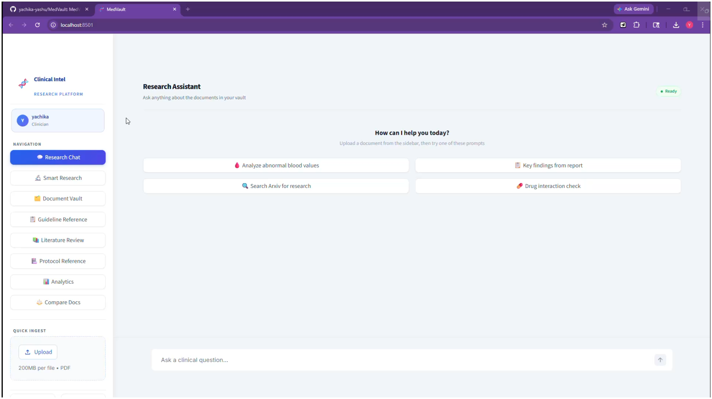

# MedVault


**MedVault** is an enterprise-grade research platform that enables healthcare teams to securely ingest medical literature, clinical guidelines, and pathology reports — transforming static documents into a dynamic, cited knowledge base for real-time, evidence-based decision support.

Built with FastAPI, LangGraph, Qdrant, Redis, PostgreSQL, and Streamlit. Runs entirely in Docker.

---

## What it does

You upload your PDFs (research papers, clinical guidelines, lab reports). The app reads, indexes, and stores them. Then you can:

- **Chat** with the documents — ask anything, get answers with citations pointing to the exact source
- **Search guidelines and protocols** by condition or topic
- **Run a literature review** on any topic
- **Compare two documents** side by side
- **Auto-find and ingest PubMed papers** for a clinical question and immediately get an answer from them
- **See analytics** — how many tokens used, cost, faithfulness of answers

Each team gets its own isolated vault and secure, private chat history. One deployment, many organisations.

---

## Features

### 1. Research Chat
Ask clinical questions in natural language. The AI agent searches your vault, retrieves the most relevant chunks, and writes a cited answer.

Every response includes inline citations like [1], [2] and a References section at the bottom:
```
[1] Vitamin D Deficiency in Adults — Smith et al. (2021) — vitamin_d_study.pdf
```
The agent can also search Arxiv for papers not in your vault. Conversations are automatically saved and persist across server restarts.

### 2. Smart Research
Type a clinical question (e.g. *"How to treat rickets in children?"*). The app:
1. Searches PubMed Central for the top 3 relevant open-access papers
2. Downloads and indexes them automatically
3. Generates an answer from those papers with citations

No manual upload needed.

### 3. Document Vault
- Upload PDFs from the sidebar (drag and drop)
- View all indexed documents in a card grid
- Click **Summary** to get a one-paragraph AI summary of any document
- Click **Analyze** to open a chat session focused on that document
- Delete documents you no longer need

### 4. Guideline Reference
Quickly find official medical recommendations (WHO, NICE, NHS, etc.) from your uploaded documents.
- **What it shows**: The exact recommendation text and its **Grade of Evidence** (how strong the advice is).
- **Benefit**: No more manual searching through 100-page PDF guidelines.
- **Example**: *"What is the first-line treatment for pediatric hypertension according to WHO?"*

### 5. Literature Review
Summarize the current state of research for any clinical topic in your library.
- **What it shows**: Where different papers **agree**, where they **disagree**, and what research is still missing.
- **Benefit**: Get a high-level overview of your entire library in seconds.
- **Example**: *"Summarize the consensus on using Vitamin D for rickets across my library."*

### 6. Protocol Reference
Fast access to hospital protocols and procedural guidelines.
- **What it shows**: Clear **step-by-step instructions** with a direct link to the original source.
- **Benefit**: Ensures you are following the latest institutional standards for any procedure.
- **Example**: *"What is the step-by-step protocol for central line insertion?"*

### 7. Compare Documents
See how any two documents in your vault differ side-by-side.
- **What it shows**: Agreements, contradictions, and key clinical differences.
- **Benefit**: Perfect for comparing a new lab report to a baseline or comparing two different studies.
- **Example**: *"Compare the patient's CBC from Jan 2024 to their latest report from May 2024."*

### 8. Analytics
- Total documents indexed
- Total queries run
- Tokens used and estimated cost
- Average faithfulness score (how grounded answers were in the source documents)
- Query history with per-query latency and token breakdown

---

## Demo & Screenshots

### Full Feature Demo

[](https://drive.google.com/file/d/1ZIAFrnsEob_uHI1dUllQRlp1FCbB3OE_/view?usp=drive_link)

**[Watch the full demo](https://drive.google.com/file/d/1ZIAFrnsEob_uHI1dUllQRlp1FCbB3OE_/view?usp=drive_link)** — Click the image or link to open in Google Drive.

---

## Architecture

MedVault is built around a multi-stage agentic RAG pipeline with full multi-tenant isolation.

```
User Request
    │
    ▼
[Nginx] ──► [Streamlit Dashboard]
    │
    ▼
[FastAPI] ──► [Redis Cache] (exact-match hit → return immediately)
    │
    ▼
[LangGraph Agent]
    ├──► [Guardrail] (clinical topic check)
    ├──► [Qdrant Hybrid Search] (dense + sparse vectors)
    ├──► [Cross-Encoder Reranker] (ms-marco-MiniLM)
    └──► [OpenAI GPT-4o-mini] (generation + citations)
    │
    ▼
[Faithfulness Check] ──► [PostgreSQL TraceLog]
    │
    ▼
[Redis + Qdrant Semantic Cache] (write result for future hits)
    │
    ▼
Streamed SSE Response → Dashboard
```

**Ingestion pipeline:** PDF → Docling (layout-aware extraction) → chunking (~1500 tokens with overlap) → dense + sparse embeddings → Qdrant (tenant-tagged).

**Multi-tenancy:** Every user belongs to a `team_code`. Every chunk stored in Qdrant is tagged with a hashed `tenant_id`. The agent query layer enforces tenant filtering at the database level — the LLM never sees data outside its tenant.

**LangGraph state machine:** The agent is not a linear chain. It can loop — search the vault, decide it needs more context, reformulate the query with clinical synonyms, and search again — before generating the final answer.

**Visual linking:** When Docling extracts a PDF it tags figures with stable IDs (`<!-- picture-0 -->`). When the agent retrieves a chunk containing an `[IMAGE_REFERENCE]` tag it can include the figure in its response, not just the surrounding text.

---

## Governance & Security

Designed for clinical environments where data integrity and privacy are non-negotiable:

- **Multi-Tenant Isolation**: Organisation data is strictly isolated at the database level using tenant-aware Qdrant filtering and PostgreSQL scoping.
- **JWT Authentication**: Secure access via industry-standard JSON Web Tokens.
- **Audit Trail**: Every query and ingestion event is logged (TraceLog) for governance, tracking both source grounding and faithfulness.
- **Local Sovereignty**: All document processing, vector storage, and state management can be run within your private infrastructure.
- **Secure SSE**: Real-time streaming tokens are delivered over secure encrypted channels.

---

## Quick Start (Docker)

**Prerequisites:** Docker Desktop, an OpenAI API key.

```bash
# 1. Clone the repo
git clone https://github.com/yachika-yashu/MedVault.git
cd medvault

# 2. Set up environment
cp .env.example .env
```

Open `.env` and fill in at minimum:
```
OPENAI_API_KEY=sk-...
JWT_SECRET_KEY=any-long-random-string
POSTGRES_PASSWORD=choose-a-password
```

```bash
# 3. Build and start everything
docker compose up -d --build
```

That's it. Wait about 30 seconds for services to start, then open:

| Service | URL |
|---|---|
| Dashboard | http://localhost:8501 |
| API docs | http://localhost:8000/docs |

### First steps
1. Open the dashboard at **http://localhost:8501**
2. Click **Register** and create an account
3. Upload a PDF using the **Quick Ingest** panel in the sidebar
4. Go to **Research Chat** and ask a question about it

---

## Production Deployment

For a production server with SSL, Nginx, and Gunicorn:

```bash
# 1. Set up production environment
cp .env.production.example .env.production
# Fill in DOMAIN, OPENAI_API_KEY, JWT_SECRET_KEY, POSTGRES_PASSWORD

# 2. First deploy (builds image, initialises SSL via Certbot)
./deploy.sh --build --ssl-init

# 3. Subsequent updates
./deploy.sh --build
```

Key differences from dev:
- Gunicorn manages multiple workers (no `--reload`)
- Internal services (Qdrant, Redis, Postgres) have no exposed host ports
- Nginx handles SSL termination, rate limiting, and WebSocket proxying
- All services restart automatically unless manually stopped

### Deploying to AWS

**Option 1 — EC2 + Docker Compose (recommended starting point)**
1. Launch a `t3.medium` or larger Ubuntu instance
2. Install Docker and Docker Compose
3. Clone the repo, copy `.env.production.example` → `.env.production`, fill in your values
4. Run `./deploy.sh --build --ssl-init`
5. Point your domain's A record to the EC2 public IP — Certbot handles SSL automatically

**Option 2 — AWS App Runner (easiest, auto-scales)**
1. Build and push the image to Amazon ECR
2. Create an App Runner service pointed at your ECR repo
3. Inject `.env.production` variables via the App Runner environment config

**Persistent storage on AWS**
- Mount an EBS volume to `./qdrant_storage` so vector data survives container restarts
- `research.db` and `checkpoints.db` (SQLite) should also live on the same persistent volume
- Logs go to `STDOUT` and are automatically captured by CloudWatch when running on ECS or App Runner

**Pre-production benchmark**
Before cutting over traffic, capture a baseline:
```bash
python perf/benchmark_api.py --mode health --runs 10
python perf/benchmark_api.py --mode query --token "<TOKEN>" --query "Summarize the latest uploaded paper." --runs 5
```
Save the output so you have a before/after record once AWS networking and load balancers are in place.

---

## How to try each feature

### Upload a document
In the sidebar, drag a PDF onto the upload box and click **Index Document**. A progress bar shows extraction → chunking → embedding → indexing. Takes 10–60 seconds depending on PDF size.

### Ask a question
Go to **Research Chat**. Type your question. The response streams in with citations. Example:
> *"What are the main risk factors for vitamin B12 deficiency according to the uploaded guidelines?"*

### Smart Research (no upload needed)
Go to **Smart Research**. Type a clinical question. The app finds PubMed papers, indexes them, and answers — all in one step. Example:
> *"What is the evidence for vitamin D supplementation in rickets?"*

### Search guidelines
Go to **Guideline Reference**. Type a condition like *"hypertension"* or *"sepsis"*. Returns the most relevant guideline excerpts from your vault.

### Literature review
Go to **Literature Review**. Type a topic. The app synthesizes findings across all matching documents.

### Compare two documents
Go to **Compare Docs**. Select two documents from the dropdowns. The AI writes a structured comparison.

### Check analytics
Go to **Analytics** to see token usage, cost, and query history.

---

## How a Query Works

1. Question comes in → check Redis for exact match (returns instantly if cached)
2. If not cached → guardrail checks if it's a clinical question
3. Agent searches vault using hybrid search (dense vectors + BM25 keyword)
4. Cross-encoder reranks results to pick the best chunks
5. LLM generates answer with citations
6. Faithfulness check verifies answer is grounded in sources
7. Result cached in Redis and Qdrant semantic cache

---

## Advanced Retrieval Strategy

The platform uses a sophisticated "Multi-Stage" retrieval pipeline to ensure maximum accuracy:

1. **Hybrid Search**: Concurrent search using **Dense Vectors** (for semantic meaning) and **Sparse Vectors** (BM25 for exact medical terminology).
2. **Matryoshka Embeddings**: High-performance embeddings optimized for both speed and retrieval depth.
3. **Cross-Encoder Reranking**: A second-pass reranker (`ms-marco-MiniLM`) evaluates the top candidates to ensure the most clinically relevant chunks are sent to the LLM.
4. **Agentic Recovery**: If the initial search yields poor results, the LangGraph agent automatically reformulates the query using clinical synonyms.

---

## Environment Variables

| Variable | Required | Description |
|---|---|---|
| `OPENAI_API_KEY` | Yes | Powers embeddings and generation |
| `JWT_SECRET_KEY` | Yes | Signs auth tokens — keep secret |
| `POSTGRES_PASSWORD` | Yes | Database password |
| `DOMAIN` | Prod only | Your domain name for SSL and CORS |
| `LANGCHAIN_API_KEY` | No | LangSmith tracing (recommended) |
| `GOOGLE_CLIENT_ID` | No | Google OAuth login |

Full list in `.env.example` (development) and `.env.production.example` (production).

---

## Tech Stack

| Layer | Technology |
|---|---|
| API | FastAPI + Uvicorn/Gunicorn |
| AI Agent | LangGraph (stateful reasoning) |
| LLM | GPT-4o-mini (OpenAI) |
| Embeddings | text-embedding-3-small |
| Reranker | cross-encoder/ms-marco-MiniLM-L-6-v2 |
| Vector DB | Qdrant (hybrid dense + sparse search) |
| Cache | Redis (exact) + Qdrant (semantic) |
| Database | PostgreSQL |
| Conversation Store | SQLite (with persistent volume) |
| PDF Extraction | Docling + Tesseract OCR fallback |
| Dashboard | Streamlit |
| Observability | LangSmith |
| Reverse Proxy | Nginx |
| Containers | Docker Compose |

---

## Running Tests

The test suite runs end-to-end against a live stack. Start the app first, then:

```bash
# Make sure the stack is running
docker compose up -d

# Run all feature tests
python test_all_features.py
```

Tests cover auth, document ingestion, research chat, smart research, guideline search, literature review, document comparison, and analytics. Each test prints `[PASS]` or `[FAIL]` with a detail line on failure.

The `dummy_blood_report.pdf` included in the repo is used as the test document — no upload required.

---

## Troubleshooting

**Services won't start / port already in use**
```bash
# Check what's using the ports
docker ps
# Stop conflicting containers
docker compose down
```

**Qdrant storage permission error on Linux**
```bash
# Fix volume ownership
sudo chown -R 1000:1000 qdrant_storage/
```

**`OPENAI_API_KEY` error on first start**
Ensure the key is set in `.env` (not just exported in your shell) — Docker Compose reads the file directly.

**Dashboard shows "Connection refused" / blank page**
The API container may still be initialising. Wait 30–60 seconds after `docker compose up` and refresh. Check logs with:
```bash
docker compose logs api --tail=50
```

**Ingestion hangs on large PDFs**
Docling's layout extraction is CPU-bound. A 100-page PDF can take 2–3 minutes. The progress bar in the sidebar will update as each stage completes.

**Answers are slow or missing citations**
Check that your `OPENAI_API_KEY` has active quota. Run `docker compose logs api --tail=20` to see if rate-limit errors are being returned.

**Tests fail with `ConnectionError`**
The test suite targets `http://localhost:8000`. Make sure the stack is fully up before running `python test_all_features.py`.

---

## Contributing

1. Fork the repo and create a feature branch: `git checkout -b feat/your-feature`
2. Make your changes and add tests where applicable
3. Run the test suite to confirm nothing is broken: `python test_all_features.py`
4. Open a pull request — include what the change does and why

Bug reports and feature requests are welcome via GitHub Issues.

---

## ⚠️ Medical Disclaimer

**MedVault is a research assistant tool intended to support clinical decision-making by surfacing relevant medical literature and guidelines. It is NOT a medical device and does not provide medical advice, diagnosis, or treatment.**

- All AI-generated responses should be verified against the cited source documents.
- Final clinical responsibility and decision-making authority remain solely with the treating clinician.
- Users must comply with their local institutional data privacy and HIPAA/GDPR guidelines when uploading patient-related data.

---

## License

[MIT License](LICENSE)
